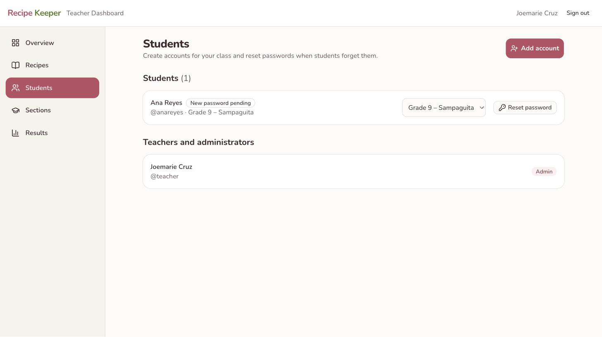
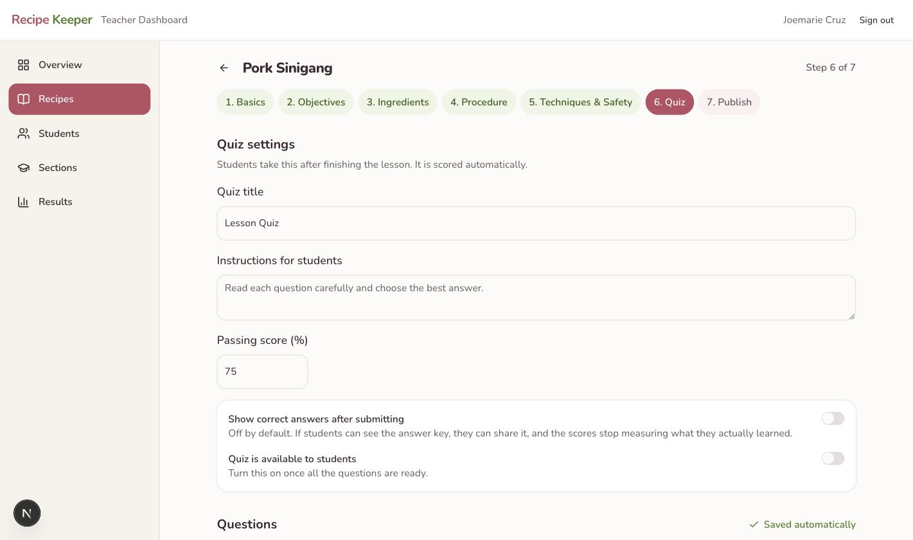
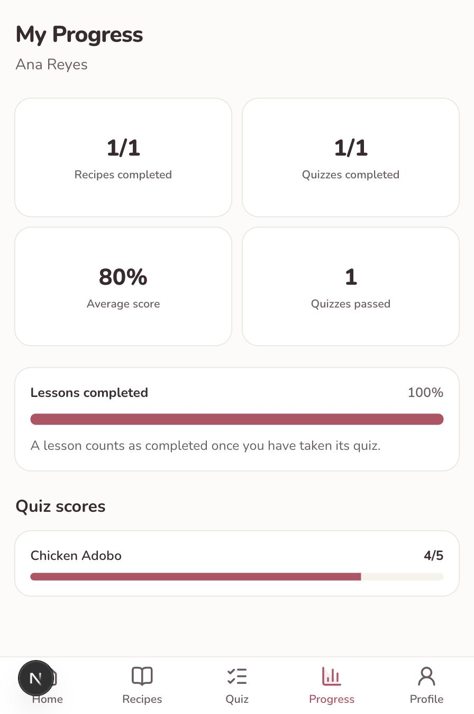
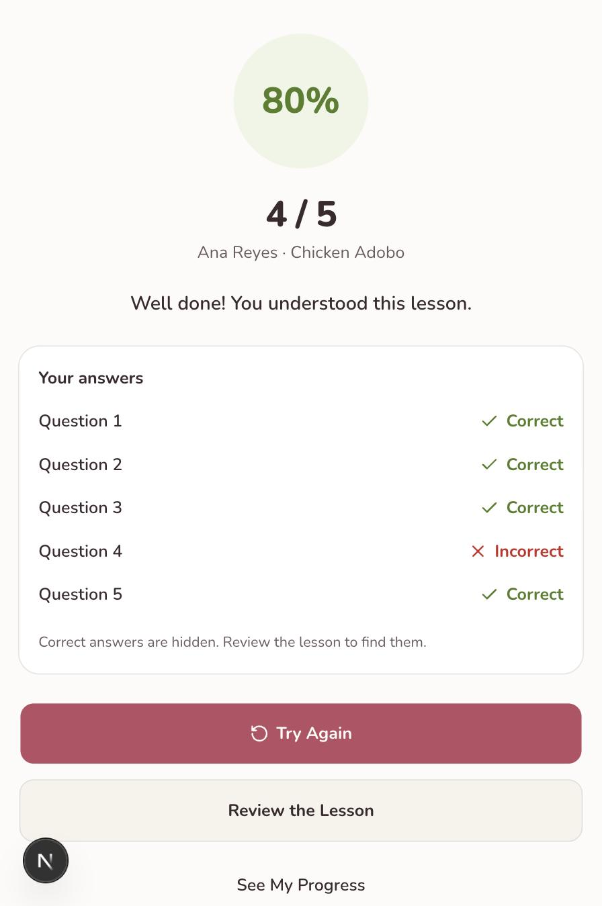
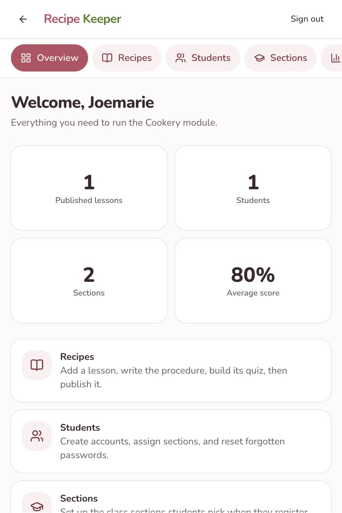

# Recipe Keeper — User Manual

A guide for the teacher running the Cookery module, and a reference for what
students see.

**Address:** https://recipe-keeper-delta.vercel.app

Nothing needs to be installed. It opens in any browser, on a phone or a laptop.

---

## Part 1 — Getting set up

### Signing in

Open the address above and tap **Get Started**, then enter your username and
password. Teachers and administrators go straight to the Teacher Dashboard;
students go to their lessons.

### Installing it on a phone

Students can add it to their home screen so it opens like an app:

- **Android (Chrome):** tap the ⋮ menu → *Add to Home screen*
- **iPhone (Safari):** tap the Share button → *Add to Home Screen*

After that it has its own icon and opens without the browser bar.

### Setting up your class sections

Do this first, because students choose their section when they register.

1. Open **Sections**
2. Tap **Add section**
3. Enter the grade (9), the section name (for example *Sampaguita*), and the
   school year
4. Tap **Save**

### Creating student accounts

You can let students register themselves, or create their accounts for them.
Creating them yourself is usually simpler with a whole class.

1. Open **Students** → **Add account**
2. Fill in the student's full name, email, username, and section
3. Tap **Create account**

A **temporary password** appears on screen — for example `Adobo4821`. Write it
down or hand it to the student straight away, because **it is only shown once.**
The student will be asked to choose their own password the first time they sign
in.

### When a student forgets their password

Open **Students**, find their name, and tap **Reset password**. A new temporary
password appears. Give it to them; they will choose a new one when they sign in.

You never need to know a student's password, and you cannot see it.

---

## Part 2 — Building a lesson

Open **Recipes** → **New Recipe**. The lesson is built in seven short steps.

**Everything saves by itself as you type.** You will see *Saved automatically*
at the top right. There is no Save button, and you can close the page and come
back later without losing work.

You can also jump between the seven steps in any order using the numbered
buttons, so you can leave a section unfinished and return to it.

### Step 1 — Basics

The recipe name, category, a short description, and a photo of the finished
dish. Difficulty, servings, and timings are optional.

If you have a video, upload it to YouTube first and set it to **Unlisted**, then
paste the link here. Unlisted means only people with the link can watch it.

### Step 2 — Objectives

What students should be able to do after the lesson. Students see these as
*"After this lesson, you should be able to…"*. Write one per line.

### Step 3 — Ingredients

The measurement and the ingredient go in separate boxes — `1 kg` and `chicken` —
so students see them clearly. The third box is for a note like *cut into serving
pieces*.

### Step 4 — Procedure

One step at a time. Steps are numbered automatically, so if you reorder them
with the arrows, the numbers fix themselves. Each step can have its own photo.

### Step 5 — Techniques and safety

Tick the cooking techniques the recipe uses. The explanations are written once
and shared by every recipe, so you never retype them.

Then write the kitchen safety reminders and your chef's tips. **Students see the
safety section highlighted in red**, before they start cooking.

### Step 6 — Quiz

Write each question, fill in the four choices, and **tap the letter of the
correct answer** so it turns green.

Two switches worth understanding:

- **Show correct answers after submitting** — off by default. If students can
  see the answer key they can share it, and the scores stop measuring what they
  actually learned. Leave this off while the study is running.
- **Quiz is available to students** — turn this on once every question is ready.

### Step 7 — Publish

A checklist shows what is still missing. When you are ready, tap **Publish for
students**.

Until you publish, students cannot see the lesson at all. You can unpublish at
any time.

---

## Part 3 — Seeing how students are doing

Open **Results**.

Each row is a student's **best score** on one lesson, with the number of
attempts. Retakes are encouraged — the best score is what counts, but every
attempt is stored.

**Download CSV** gives you a spreadsheet with *every* attempt, not just the best
one, including the date and attempt number. This is the file to use for the
statistical analysis in your paper.

---

## Part 4 — What students see

A student opens a lesson and moves through it one section at a time — overview,
objectives, ingredients, procedure, techniques, safety, tips — with a progress
bar at the top and a **Next** button at the bottom. They cannot skip ahead past
the safety section on their way to the quiz.

They can tick off ingredients as they gather them.

At the end they take the quiz, one question per screen, and get their score
immediately.

The result shows which questions were right and wrong, but **not** the correct
answers, so they have to review the lesson. They can retake the quiz as often as
they like.

**My Progress** shows lessons completed, quizzes taken, and their average score.
A lesson counts as completed once its quiz has been taken.

---

## Part 5 — On a phone

Everything works on a phone, including the Teacher Dashboard, so you can check
results between classes.

Building a lesson is more comfortable on a laptop, simply because there is more
typing.

---

## Common questions

**A student says they cannot sign in.**
Check the username in **Students** — it is easy to mistype. If the password is
the problem, tap **Reset password**.

**A student cannot see a lesson.**
It is probably still a draft. Open it and check step 7, Publish.

**A student sees the lesson but there is no quiz.**
The quiz has its own switch. Open step 6 and turn on *Quiz is available to
students*.

**Can I change a question after students have answered it?**
Yes. Editing a question keeps the answers students have already given. Deleting
a question removes its answers along with it.

**Can students see the answers?**
No, unless you switch on *Show correct answers after submitting* for that quiz.
The answers are never sent to a student's phone.
